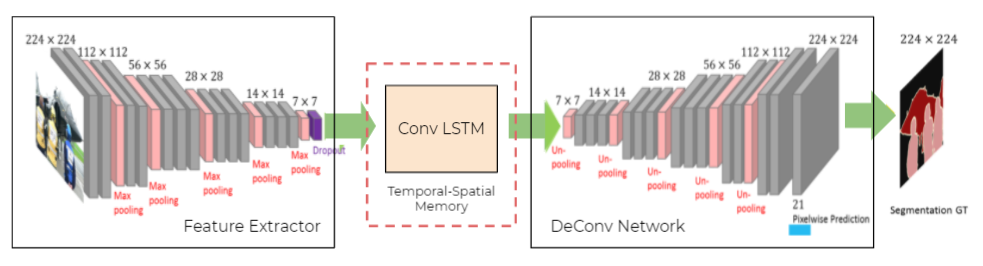

## ConvLSTM

---

**Conv Lstm:** Convolutional LSTMs (Long Short Term Memory) can beused to remember and track images instead of applying object detection techniques will help save time, computational powerand will be more efficient.

Thus an LSTM, based memory model is proposed to detect an object in a single frame andthen tracking the object using and hybrid of Resnet 18, Resnet101, FCN 32 and Conv LSTM network. Thus, this model makes the process, computationally fast and is robust. Being computationally effecient, this model can also be deployed on mobile devices for application of lane detection.

  

## Our Model

We aim to use ConvLSTM, as a temporal-spatial memory to store important feature extracted by the feature extractor. we believe that within two consecutive frames of a video, not many features change and thus these features from t-1 frame can be used with some updates from t frame to segment frame t.

We insert this Conv Lstm, between the Feature Extractor and the Deconv net, as to store the most densely packed features in our temporal memory.

This is our model:

  

This code is written in PyTorch.
