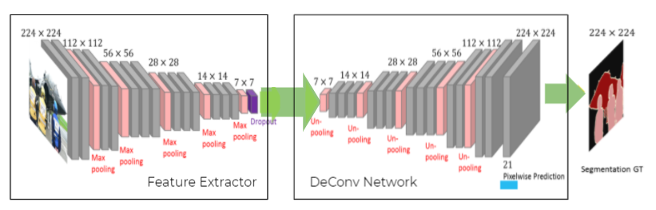

## Memory Guided Road Detection

---

In self driving car applications, there is a require-ment to predict the location of the lane given an input RGBfront facing image. In this paper, we propose an architecture thatallows us to increase the speed and robustness of road detectionwithout a large hit in accuracy by introducing an underlyingshared feature space that is propagated over time, which servesas a flowing dynamic memory. By utilizing the gist of previousframes, we train the network to predict the current road with agreater accuracy and lesser deviation from previous frames.

## Demo

The Demo for this repository can be seen at this colab link:
https://colab.research.google.com/drive/1q8a1p3qmfJJrIqRpOlvwB1qCiVTxalXW?usp=sharing

To run the colab file, **you'll need access to our shared drive**.

## Models we have implemented

### 1. Resnet18 FCN

For baseline comparisons, we train FCN32s deconvolution block, preceeded by different bare features extractors. We observe that using a small Feature extractor like the Resnet18, gives us a faster inference time trading off our accuracy.

```
Average FPS: 155.4
Average IOU: 0.852
```

<p align="center">
  
</p>

Implemented [here](Resnet18)

### 2. Resnet101 FCN

Using a more intricate feature extractor like ResNet-101, we get better results at the cost of inference time.

```
Average FPS: 46.18
Average IOU: 0.915
```

<p align="center">
  
</p>

Implemented [here](Resnet101)

### 3. VGG Batched Interleaved model

The model that trains over similar images to create the lstm memory. For training the model, we replicate the images and pass them through the feature extractor and the ConvLSTM, to prepare the temporal memory. Using the memory, we infer the last image and calculate the loss after decoding the segmentation map with ground truth.

<p align="center">
  
</p>

Implemented [here](VGG_batched_interleaved)

### 4. Batched Interleaved Model

Using the Similar idea in 3, We use the Resnet Model, as Resnet is proved to be a faster Feature detector while still having a similar accuracy to that of VGG.

```
Average FPS: 146.02
Average IOU: 0.88
```

<p align="center">
  
</p>

Implemented [here](Resnet_batched_interleaved)

### 5. Sequential Interleaved model

The model that trains over 6 sequential images. The LSTM memory is generated using the 5 sequential images. Using this temporal memory we infer the 6th image and calculate the loss. The weights are updated using the obtained loss.

```
Average FPS: 146.53
Average IOU: 0.872
```

<p align="center">
  
</p>

Implemented [here](Resnet_sequential_interleaved)

## Results

### Qualitative Results

<p align="center">
  
  
<br>
Left: Resnet18 , Right: Resnet101    
    
</p>

<p align="center">
  
  
<br>
Left: Batched Interleaved , Right: Sequential Interleaved  
</p>

Comparing results between different models, we see thatthe Vanilla ResNet models and interleaved models perform similarly at each given frame. We notice that occasionally the prediction moves into the pavement as well. However, it is evident from the videos that the temporal consistency ofthe interleaved models is far superior than the vanilla models which simply treat each frame as an independent prediction.

### Quantitive Results

We obtain the following results

|          Name          |  Strategy   | Avg IoU | Avg FPS |
| :--------------------: | :---------: | :-----: | :-----: |
|       Resnet 18        |   Vanilla   |  0.852  |  155.4  |
|       Resnet 101       |   Vanilla   |  0.915  |  46.18  |
|                        |             |         |         |
|  Batched interleaved   | Randn > 0.9 |  0.878  | 132.58  |
|  Batched interleaved   |   1 in 6    |  0.877  | 135.73  |
|  Batched interleaved   |   1 in 10   |  0.88   | 146.02  |
|  Batched interleaved   |   1 in 12   |  0.879  | 147.92  |
|                        |             |         |         |
| Sequential Interleaved | Randn > 0.7 |  0.872  | 117.91  |
| Sequential Interleaved | Randn > 0.8 |  0.872  | 132.12  |
| Sequential Interleaved | Randn > 0.9 |  0.871  | 146.53  |
| Sequential Interleaved |   1 in 6    |  0.871  | 132.42  |
| Sequential Interleaved |   1 in 10   |  0.872  | 141.31  |
| Sequential Interleaved |   1 in 12   |  0.868  | 139.64  |

As seen from the table, we notice that the Vanilla ResNet performs the fastest, whereas the Resnet 101 is the most accurate.

All of the experiments were performed on a laptop on an NVIDIA GTX 1650 GPU, and AMD Ryzen 4600H CPU with 8GB RAM.
