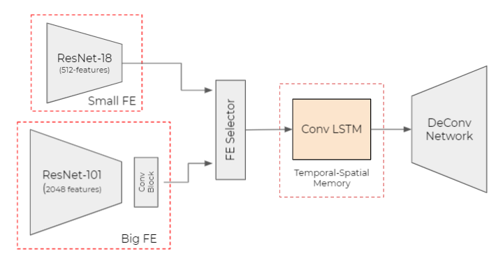

## Sequential Interleaved Model

Using N time seperated images to train the ConvLSTM, we train this model over the lane segementation dataset.

This is our model:

  

This code is written in lightening and PyTorch.
